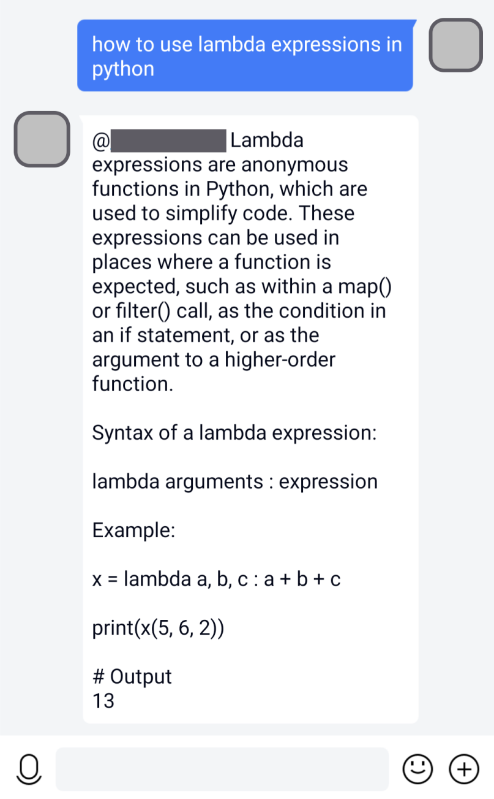
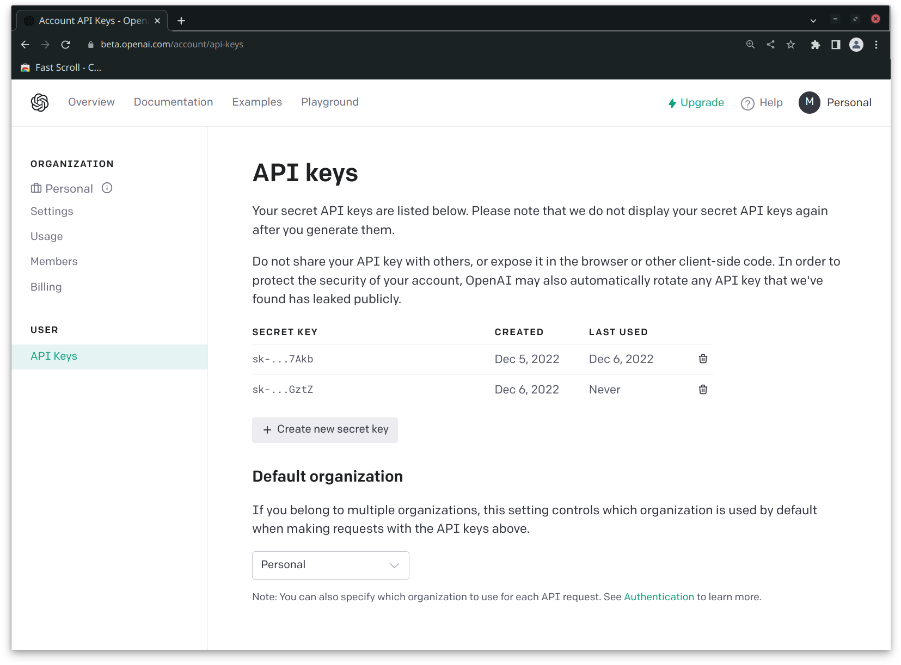

# Mirai OpenAI GPT-3 ChatBot Plugin

**This is a Mirai ChatBot plugin based on OpenAI GPT-3 API.**




## Installation

1. Download the JAR file from https://github.com/RIvance/mirai-openai-gpt-chatbot/releases

2. Copy the JAR file to `$MCL_ROOT/plugins`

3. Start MCL

4. Replace `YOUR_OPENAI_API_KEY_HERE` in the `$MCL_ROOT/config/org.ivance.chatbot/ChatBotPluginConfig.yml` config file with your OpenAI API key, like:

   ```yml
   # Your OpenAI API key, starts with `sk-`.
   # See https://beta.openai.com/account/api-keys
   token: sk-kA6y0qWzk6lFEq7SVTr7bpHoduNI9bheqUNkbQm7ZJjG39BA
   ```

5. Add the trigger prefixes / trigger keywords to the `triggerPrefixes` / `triggerWords` list, for example:

   ```yml
   # Prefixes used to trigger the response.
   # e.g. "/chat How are you today?"
   triggerPrefixes: 
     - '/chat'
     - '/聊天'
   # Keywords used to trigger the response.
   # e.g. "What is GPT3?"
   triggerWords: 
     - 'what is'
     - 'how to'
     - '为什么'
     - '怎样'
   ```

6. Restart MCL


## Q & A

### How to register an OpenAI account in China?

See https://zhuanlan.zhihu.com/p/589287744

### How to get an OpenAI API Key?

Visit https://beta.openai.com/account/api-keys



### Why is the reply incomplete?

Please change the `maxToken` attribute in the config file:
```yml
# The maximum number of tokens to generate.
# Requests can use up to 2048 tokens shared between prompt and completion.
# (One token is roughly 4 characters for normal English text)
# Notice that a large `maxToken` value may cause request timeout.
maxTokens: 500
```